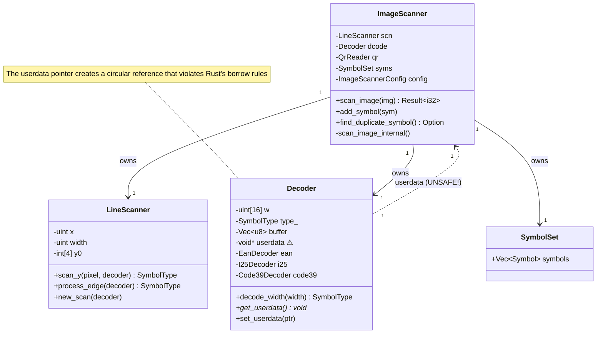
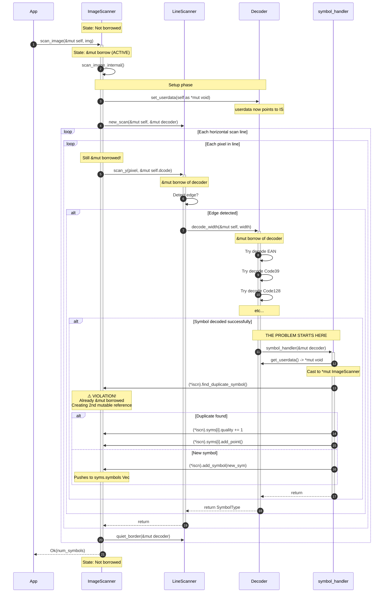
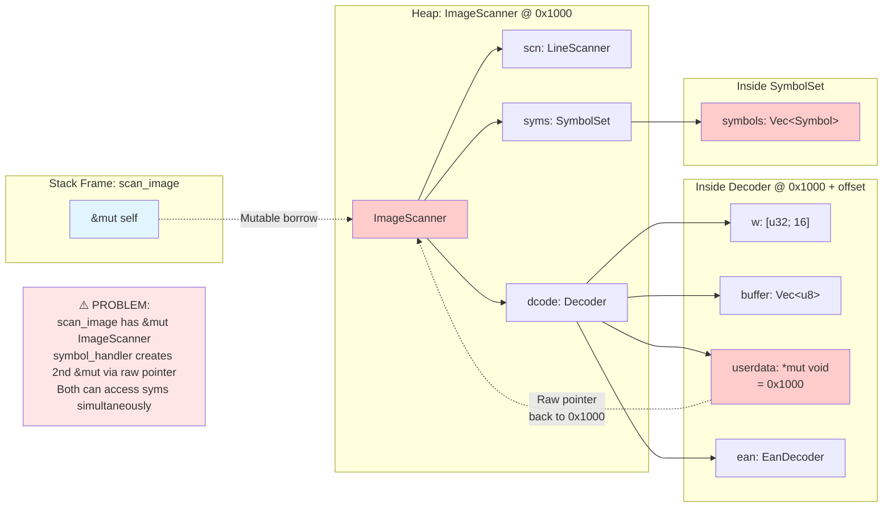

# Symbol Decoding Data Flow

This document provides detailed diagrams showing how symbols are decoded and the specific path of the unsafe `userdata` pointer.

## Object Layout and Ownership



## Complete Call Chain with Borrow States



## Memory Layout Showing the Circular Reference



## Specific Code Locations

### 1. Setup (img_scanner.rs:232-234)

```rust
fn scan_image_internal(&mut self, img: &mut zbar_image_t) -> Option<zbar_symbol_set_t> {
    // Set up decoder's back-pointer to this scanner for symbol callbacks
    let scanner_ptr = self as *mut _ as *mut c_void;  // ← Creates raw pointer
    self.dcode.set_userdata(scanner_ptr);              // ← Stores in decoder
    // ...
}
```

At this point:
- `self` is borrowed mutably for the entire function
- `scanner_ptr` is a raw pointer to the same memory
- Both exist simultaneously!

### 2. The Scan Loop (img_scanner.rs:274-279)

```rust
while (x as c_uint) < w {
    let d = data[p as usize];
    x += 1;
    p += 1;
    self.scn.scan_y(d as c_int, &mut self.dcode);  // ← Passes &mut decoder
}
```

Still inside the `&mut self` borrow from `scan_image_internal`.

### 3. Edge Detection (line_scanner.rs:253-266)

```rust
fn process_edge(&mut self, decoder: &mut zbar_decoder_t) -> SymbolType {
    // ... edge calculation ...
    self.width = self.cur_edge - self.last_edge;
    self.last_edge = self.cur_edge;

    let width = self.width;
    unsafe { decoder.decode_width(width) }  // ← Calls into decoder
}
```

### 4. Decoding (decoder.rs:926-1008)

```rust
pub(crate) unsafe fn decode_width(&mut self, w: c_uint) -> SymbolType {
    // ... store width ...

    // Try each decoder
    if self.ean.enable {
        let tmp = zbar_decode_ean(&mut *self);
        if tmp != SymbolType::None {
            sym = tmp;
        }
    }
    // ... more decoders ...

    if sym != SymbolType::None {
        // ...
        symbol_handler(self);  // ← THE CALLBACK
    }

    sym
}
```

### 5. The Unsafe Callback (img_scanner.rs:479-538)

```rust
pub(crate) unsafe fn symbol_handler(dcode: &mut zbar_decoder_t) {
    let iscn = dcode.get_userdata() as *mut zbar_image_scanner_t;  // ← Get raw pointer
    // ...

    let data = dcode.buffer_slice();
    if let Some(sym) = (*iscn).find_duplicate_symbol(symbol_type, data) {  // ← Deref!
        sym.quality += 1;  // ← Mutate through raw pointer
        if (*iscn).config.position_tracking {
            sym.add_point(x, y);
        }
        return;
    }

    // ... or create new symbol ...
    (*iscn).add_symbol(sym);  // ← Mutate through raw pointer
}
```

Here's the problem:
- `(*iscn)` creates a mutable reference from the raw pointer
- But `iscn` points to the same ImageScanner that's already borrowed by `scan_image_internal`
- We now have two mutable references to the same memory!

## Why This is Undefined Behavior

According to Rust's rules:

1. **Aliasing XOR Mutability**: You can have either:
   - Many immutable references, OR
   - Exactly ONE mutable reference

2. **Our violation**:
   - `scan_image_internal(&mut self)` creates mutable reference #1
   - `(*iscn)` in `symbol_handler` creates mutable reference #2
   - Both are active simultaneously
   - This is undefined behavior, even in unsafe code

3. **Why it "works"**:
   - The compiler can't prove the aliasing due to the raw pointer
   - No actual memory corruption happens in practice (yet)
   - But the optimizer could theoretically break this code

## Visual: The Borrow Stack Violation

```
┌─────────────────────────────────────────┐
│ Active Borrows (what Rust sees)         │
├─────────────────────────────────────────┤
│ &mut ImageScanner (scan_image)          │  ← Borrow 1
│   └─ &mut Decoder (scan_y)              │
│       └─ decode_width running...        │
├─────────────────────────────────────────┤
│ Raw pointer manipulation (hidden)       │
├─────────────────────────────────────────┤
│ &mut ImageScanner (from userdata)       │  ← Borrow 2 (ILLEGAL!)
│   └─ Calling add_symbol()               │
│   └─ Mutating syms.symbols              │
└─────────────────────────────────────────┘
      ↑                    ↑
      └────── SAME MEMORY ─┘

This violates Rust's aliasing rules!
```

## Summary

The `userdata` pointer creates a hidden circular reference that bypasses Rust's borrow checker:

1. **Outer context**: `ImageScanner` has a mutable borrow active
2. **Stored pointer**: Decoder stores a raw pointer to `ImageScanner`
3. **Callback**: Decoder calls back through the pointer
4. **Violation**: Creates a second mutable reference while the first is still active

The only way to fix this properly is to eliminate the callback pattern and use one of the solutions outlined in `UNSAFE_USERDATA_PROBLEM.md`.
