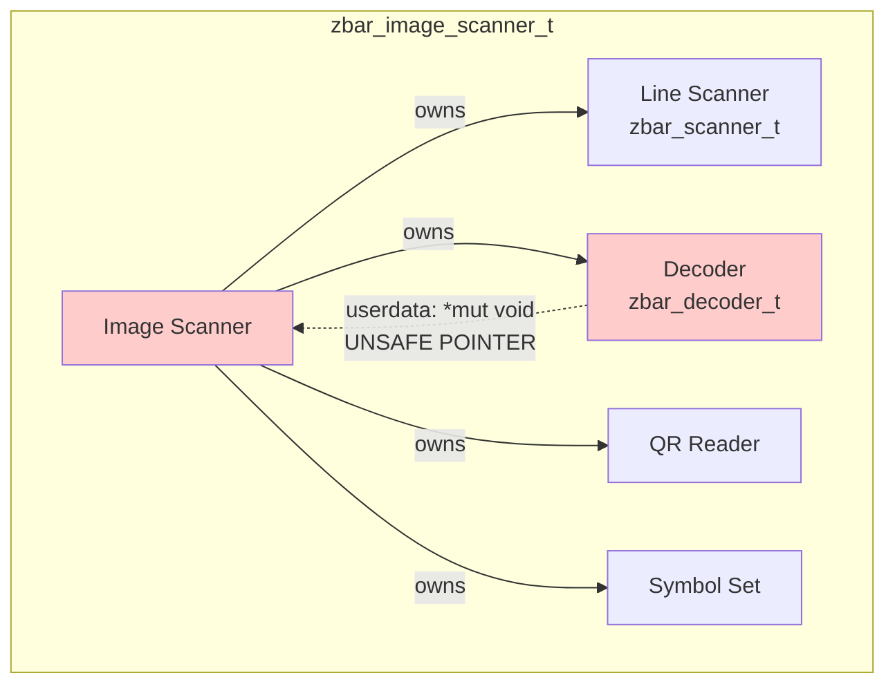
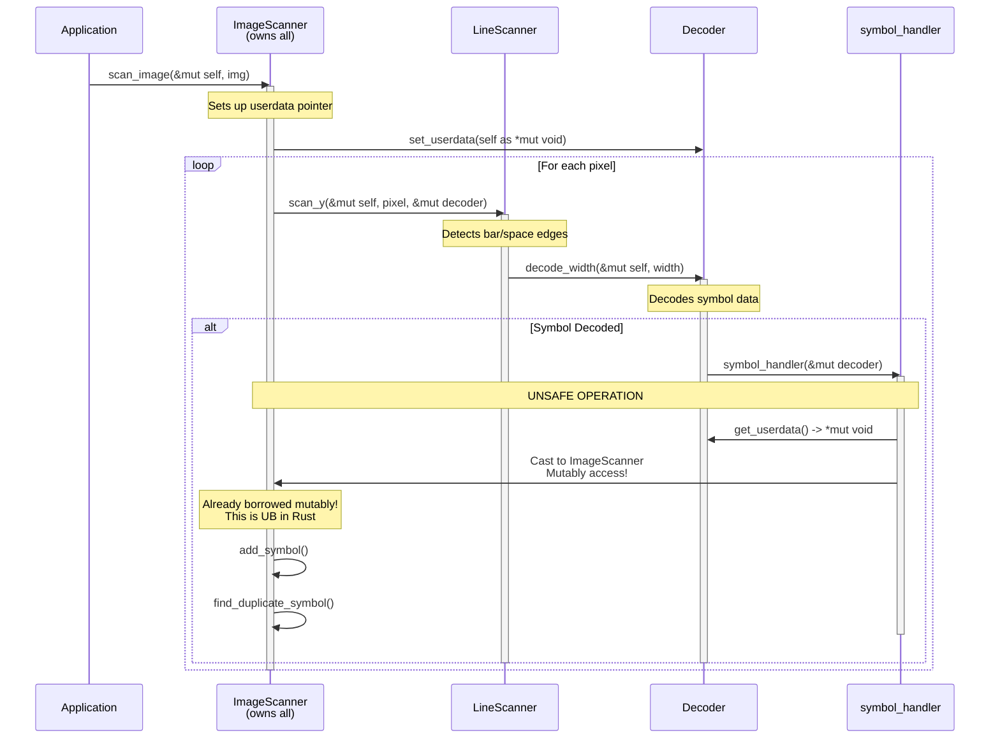

# The `userdata` Pointer Problem: Circular Borrowing in Rust

## Overview

This document explains the unsafe circular borrowing issue in the zbar Rust conversion, specifically regarding the `zbar_decoder_t::userdata` pointer that points back to `zbar_image_scanner_t`. This is the last remaining unsafe code in the codebase that needs to be eliminated.

## The Problem

### Object Structure



The `zbar_image_scanner_t` owns three key components:

- A **line scanner** (`zbar_scanner_t`) for detecting bar/space widths
- A **decoder** (`zbar_decoder_t`) for decoding symbol data
- A **symbol set** for collecting results

The problem is that the decoder needs to call back to the image scanner to report decoded symbols, creating a circular reference.

### Call Flow During Symbol Decoding



### The Borrowing Conflict

The issue is a violation of Rust's borrowing rules:

1. **Outer borrow**: `scan_image(&mut self)` creates a mutable borrow of the `ImageScanner`
2. **Inner borrow**: `scan_y(..., &mut self.dcode)` creates a mutable borrow of the decoder
3. **Callback violation**: During `decode_width()`, the decoder calls `symbol_handler()`, which:
   - Casts `userdata` back to `*mut zbar_image_scanner_t`
   - Calls methods like `add_symbol()` and `find_duplicate_symbol()`
   - This creates **another mutable borrow** of the `ImageScanner` while it's already borrowed!

### Current Code Locations

The unsafe pointer usage is in these key locations:

1. **Setting up the pointer** (img_scanner.rs:233-234):

   ```rust
   let scanner_ptr = self as *mut _ as *mut c_void;
   self.dcode.set_userdata(scanner_ptr);
   ```

2. **The callback** (decoder.rs:1004):

   ```rust
   symbol_handler(self);  // Called from decode_width
   ```

3. **Dereferencing the pointer** (img_scanner.rs:480):

   ```rust
   pub(crate) unsafe fn symbol_handler(dcode: &mut zbar_decoder_t) {
       let iscn = dcode.get_userdata() as *mut zbar_image_scanner_t;
       // ... later ...
       if let Some(sym) = (*iscn).find_duplicate_symbol(symbol_type, data) {
           // Mutably accessing ImageScanner while it's borrowed!
       }
   }
   ```

## Why This is Difficult to Fix

The challenge is that we have:

- **Ownership**: ImageScanner owns the Decoder
- **Downward calls**: ImageScanner → LineScanner → Decoder
- **Upward callbacks**: Decoder needs to call back to ImageScanner

In traditional object-oriented languages with garbage collection, this is trivial. In Rust, it violates the ownership rules.

## Potential Solutions

### 1. **Return Values Instead of Callbacks** (Most Idiomatic)

Instead of calling back during decoding, have the decoder return symbol data, and let the caller handle it.

**Pros:**

- Most Rust-idiomatic approach
- Eliminates all unsafe code
- Makes data flow explicit and testable
- Easier to reason about

**Cons:**

- Requires refactoring the decoder API
- May need to accumulate symbol data in the decoder temporarily
- Changes the control flow significantly

**Implementation sketch:**

```rust
// Instead of:
decoder.decode_width(width);  // Internally calls symbol_handler

// Return symbol data:
if let Some(symbol_data) = decoder.decode_width(width) {
    scanner.add_symbol(symbol_data);
}
```

### 2. **Interior Mutability with RefCell** (Runtime Borrow Checking)

Use `RefCell` to allow multiple borrows checked at runtime.

**Pros:**

- Minimal API changes
- Rust standard library solution

**Cons:**

- Runtime overhead for borrow checking
- Can panic if borrowing rules are violated at runtime
- Doesn't eliminate the fundamental issue, just defers checking

**Implementation sketch:**

```rust
pub(crate) struct zbar_image_scanner_t {
    // ...
    syms: RefCell<zbar_symbol_set_t>,
    // ...
}

// In symbol_handler:
(*iscn).syms.borrow_mut().symbols.push(sym);
```

### 3. **Split the Image Scanner** (Structural Refactoring)

Separate the symbol collection from the scanning logic.

**Pros:**

- Clean separation of concerns
- No unsafe code needed
- Makes testing easier

**Cons:**

- Requires significant refactoring
- Changes the public API

**Implementation sketch:**

```rust
struct SymbolCollector {
    symbols: Vec<zbar_symbol_t>,
}

impl zbar_image_scanner_t {
    fn scan_image(&mut self, img: &mut Image) {
        let mut collector = SymbolCollector::new();

        // Pass collector to decoder setup
        for pixel in img.pixels() {
            if let Some(symbol) = self.process_pixel(pixel) {
                collector.add(symbol);
            }
        }

        self.syms = collector.into_symbols();
    }
}
```

### 4. **Closure/Callback Parameter** (Functional Approach)

Pass a callback function that handles symbols, avoiding the back-pointer.

**Pros:**

- Flexible and functional
- No unsafe code
- Clear data flow

**Cons:**

- Changes decoder API significantly
- May require boxing closures
- Could impact performance

**Implementation sketch:**

```rust
impl zbar_decoder_t {
    pub(crate) unsafe fn decode_width<F>(
        &mut self,
        width: c_uint,
        mut on_symbol: F
    ) -> SymbolType
    where
        F: FnMut(SymbolData)
    {
        // ... decoding logic ...
        if symbol_complete {
            on_symbol(SymbolData { /* ... */ });
        }
        // ...
    }
}
```

### 5. **Message Passing / Channel** (Concurrent Approach)

Use channels to send symbol data from decoder to scanner.

**Pros:**

- No shared mutable state
- Very Rust-idiomatic for concurrent scenarios
- Future-proof for parallelization

**Cons:**

- Overhead of channel operations
- Overkill for single-threaded case
- More complex than needed

### 6. **Raw Pointers with Cell** (Minimal Change)

Keep raw pointers but use `Cell` for the specific fields that need mutation.

**Pros:**

- Minimal changes to existing code
- Can be done incrementally

**Cons:**

- Still uses unsafe code
- Doesn't solve the fundamental problem
- Easy to misuse

## Recommended Solution

**Option 1: Return Values** is the recommended approach because:

1. **Most idiomatic**: Aligns with Rust's ownership model
2. **Eliminates unsafe entirely**: No raw pointers, no unsafe blocks
3. **Explicit data flow**: Makes it clear what data moves where
4. **Better testing**: Each component can be tested independently
5. **Better performance**: No runtime borrow checking or indirection

### Implementation Plan for Option 1

1. **Change decoder to accumulate symbols internally**:
   - Add a `pending_symbol` field to `zbar_decoder_t`
   - When a symbol is decoded, store it instead of calling handler

2. **Return symbol data from `decode_width`**:

   ```rust
   pub(crate) fn decode_width(&mut self, width: c_uint) -> Option<DecodedSymbol>
   ```

3. **Update scanner to handle returned symbols**:

   ```rust
   if let Some(symbol) = decoder.decode_width(width) {
       self.add_symbol(symbol.into());
   }
   ```

4. **Remove userdata field entirely**:
   - Delete `userdata` from `zbar_decoder_t`
   - Remove `set_userdata()` and `get_userdata()`
   - Delete `symbol_handler()` function

5. **Update all call sites** in the scanner's scan loops

This approach requires touching several files but results in cleaner, safer code with no unsafe operations.

## Files That Need Changes

For the recommended solution (Option 1):

1. **src/decoder.rs**:
   - Remove `userdata` field (line 647)
   - Add `pending_symbol` field
   - Change `decode_width` to return `Option<DecodedSymbol>` (line 926)
   - Remove symbol_handler call (line 1004)
   - Remove `get_userdata()`/`set_userdata()` (lines 1015-1022)

2. **src/img_scanner.rs**:
   - Remove `set_userdata()` call (line 234)
   - Update calls to `decode_width()` to handle returned values (lines 278, 298, 336, 356)
   - Remove `symbol_handler()` function entirely (lines 479-538)

3. **src/line_scanner.rs**:
   - Update `process_edge()` to handle returned symbols (line 266)
   - Update `scanner_flush()` to propagate symbols (line 116)

## Conclusion

The `userdata` pointer represents a fundamental mismatch between C's liberal pointer usage and Rust's strict ownership model. While the current code "works" behind unsafe blocks, it prevents us from having a fully safe codebase.

The recommended solution is to refactor the decoder to return symbol data rather than calling back through a raw pointer. This requires moderate refactoring but results in idiomatic, safe Rust code that's easier to maintain and reason about.
